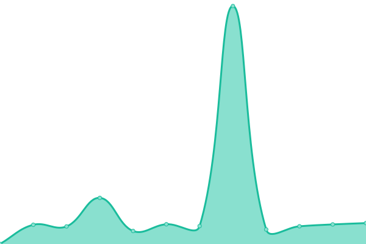

# [📈 Live Status](https://status.amskey.f5.si): <!--live status--> **🟥 Complete outage**

This repository contains the open-source uptime monitor and status page for [amsc-tech](https://status.amskey.f5.si), powered by [Upptime](https://github.com/upptime/upptime).

With [Upptime](https://upptime.js.org), you can get your own unlimited and free uptime monitor and status page, powered entirely by a GitHub repository. We use [Issues](https://github.com/amsc-tech/amskey-status/issues) as incident reports, [Actions](https://github.com/amsc-tech/amskey-status/actions) as uptime monitors, and [Pages](https://status.amskey.f5.si) for the status page.

<!--start: status pages-->
<!-- This summary is generated by Upptime (https://github.com/upptime/upptime) -->
<!-- Do not edit this manually, your changes will be overwritten -->
<!-- prettier-ignore -->
| URL | Status | History | Response Time | Uptime |
| --- | ------ | ------- | ------------- | ------ |
|  [misskey.rest](https://misskey.rest) | ダウン | [misskey-rest.yml](https://github.com/amsc-tech/amskey-status/commits/HEAD/history/misskey-rest.yml) | 

 1047ms
     
 | 

<a href="https://status.amskey.one/history/misskey-rest">94.97%</a>
    

|  [Media Server](https://media.misskey.rest) | ダウン | [media-server.yml](https://github.com/amsc-tech/amskey-status/commits/HEAD/history/media-server.yml) | 

 1226ms
     
 | 

<a href="https://status.amskey.one/history/media-server">94.89%</a>
    

<!--end: status pages-->

[**Visit our status website →**](https://status.amskey.one)

## 📄 License

- Powered by: [Upptime](https://github.com/upptime/upptime)
- Code: [MIT](./LICENSE) © [Anand Chowdhary](https://anandchowdhary.com), supported by [Pabio](https://pabio.com)
- Data in the `./history` directory: [Open Database License](https://opendatacommons.org/licenses/odbl/1-0/)
